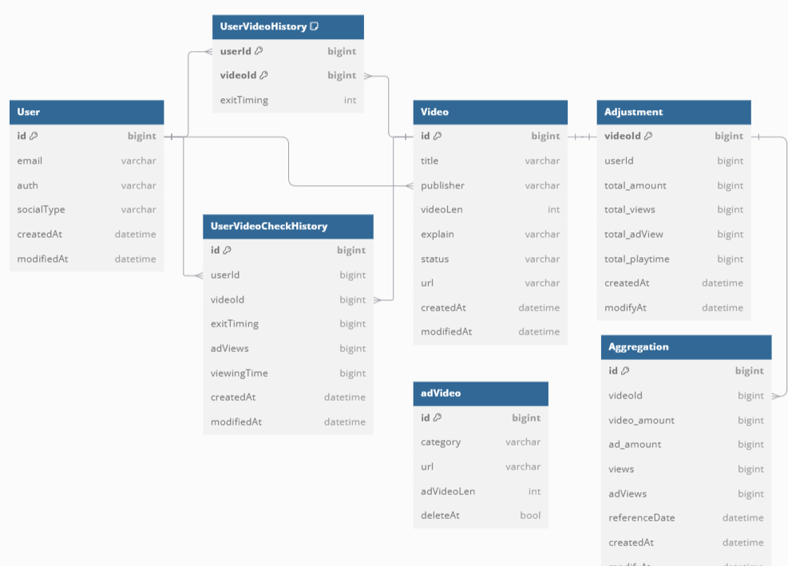

# Adjustment (정산)
2024.10.16 ~ 2024.11.13   
## 목차
[📒프로젝트 소개](#프로젝트-소개)   
[👷아키텍처](#아키텍처)     
[🔎주요 기능](#주요-기능)   
[👨‍💻프로젝트 사용 가이드](#프로젝트-사용-가이드)   


## 프로젝트 소개📒
이 프로젝트는 Video 스트리밍 서비스의 정산시스템을 구현했습니다. 
유저가 영상 재생, 정지, 광고시청을 하면 기록됩니다.
유저의 기록을 바탕으로 배치를 통해 통계 및 정산하여 
일간, 주간, 월간 데이터를 생성 및 제공합니다.

## 아키텍처👷
### 디렉토리 구조
- - -
```text
adjustment
  ├─api                 # api 요청 관련 
  │  ├─controller       # controller
  │  ├─dto              # request,response DTO
  │  │  ├─request
  │  │  └─response
  │  └─utils            # api 관련 utils
  ├─batch               # 배치 관련
  │  ├─faultTolerant    # 배치 실패 관리 클래스
  │  ├─listener         # 배치 listener 클래스
  │  ├─partitioner      # 배치 partitioner 클래스 
  │  ├─processor        # 배치 processor 클래스
  ├─client              # client
  │  └─feign
  ├─config              # config 클래스
  ├─domain              # 도메인 
  │  ├─adjustment       # 정산 도메인
  │  ├─adVideo          # 광고비디오 도메인
  │  ├─history          # 기록 관련 도메인
  │  ├─user             # 유저 도메인
  │  └─video            # 비디오 도메인
  ├─security            # 보안 관련
  └─usecase             # UseCase
  
```
### ERD
- - -

## 🔎주요 기능
- **동영상 스트리밍 기능**
    - 유저가 동영상을 시청 및 정지
    - 어뷰징 방지
- **통계 및 정산 기능**
  - Spring Batch 를 사용하여 일일 통계를 내고 그에 따른 정산 진행

## 트러블 슈팅
[트러블 슈팅 노션](https://www.notion.so/150960ca35e580e2ab49c9c2444910ba?pvs=4)

## 👨‍💻 프로젝트 사용 가이드
### 💻사용 스택 및 버전💻
- Java 21
- SpringBoot 3.3.4
- PostgreSQL 13
- Redis 7.4
- Docker 

### 설치
``` 

```
### 실행
```
docker-compose up -d --build
```

### API 명세서
[API 명세서 노션](https://www.notion.so/API-150960ca35e580049042fa320efbe8f3?pvs=4)


